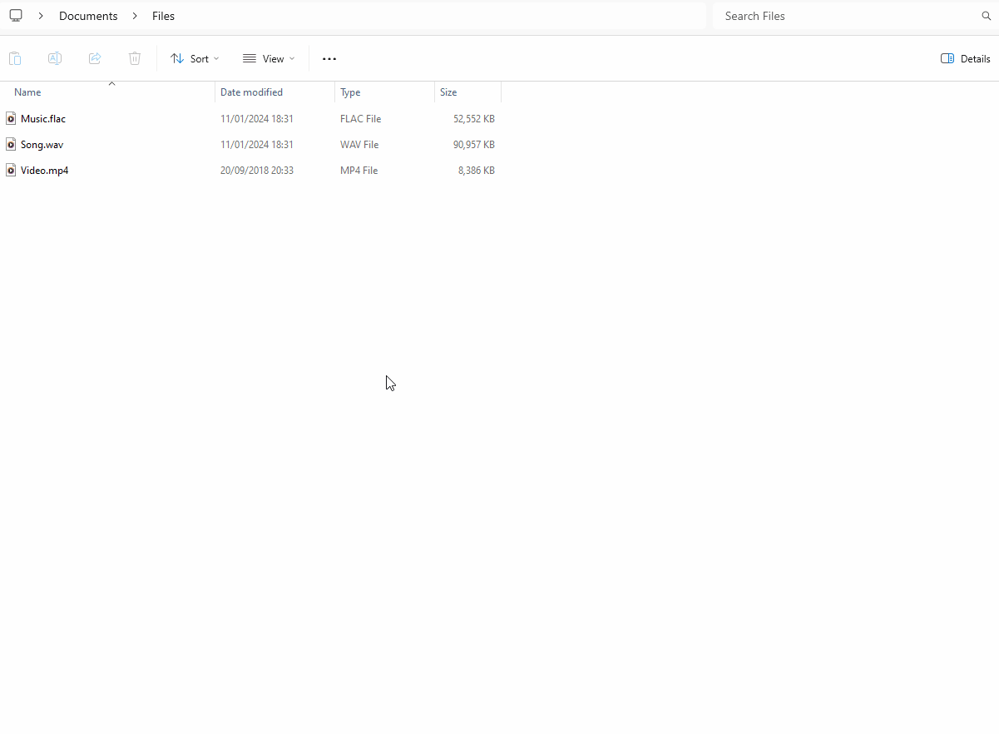

# File Converter

[](https://github.com/Regine88/FileConverter/releases)
[](LICENSE.md)

基于 [Tichau/FileConverter](https://github.com/Tichau/FileConverter) 的改进版（当前 **v2.2.2**）。

**File Converter** 是一款简洁的 Windows 工具：在资源管理器右键菜单中即可转换、压缩一个或多个文件。



## 下载安装

| 项目 | 链接 |
|---|---|
| 最新安装包 (x64 MSI) | [FileConverter-2.2.2-x64-setup.msi](https://github.com/Regine88/FileConverter/releases/download/v2.2.2/FileConverter-2.2.2-x64-setup.msi) |
| 全部 Release | https://github.com/Regine88/FileConverter/releases |
| 原项目主页 | https://file-converter.io/ |
| 原项目 Wiki | https://github.com/Tichau/FileConverter/wiki |

**系统要求**

- Windows 10/11 **x64**
- .NET Framework 4.8
- Word / Excel / PowerPoint 文档转换需要已安装对应的 Microsoft Office（COM 自动化）

> 当前仅支持 **x64**。不再提供 x86 安装通道，详见 [docs/PLATFORM_SUPPORT.md](docs/PLATFORM_SUPPORT.md)。

### 校验安装包（可选）

```powershell
Get-FileHash .\FileConverter-2.2.2-x64-setup.msi -Algorithm SHA256
# 期望: 49C7ACA4FF70DECC3E491336ED2E655632B069CA82EA5A83D2C9C8C647672B5B
```

`version.xml` 中的下载地址与 SHA-256 已与本仓库 Release 同步。

## 本仓库主要改进（相对上游）

- **Office 转换稳定性**：转换任务在 **STA** 线程执行，修复 Word 转 PDF 时进程闪退
- **安装包完整性**：MSI 包含 `FileConverter.Core` 与 **NetOffice** 程序集（`WordApi` / `ExcelApi` / `PowerPointApi` 等），避免运行时报找不到程序集
- **FFmpeg**：并发读取 stdout/stderr、检查退出码、超时与进程树终止
- **ImageMagick**：升级 Magick.NET，进程级资源限制；PDF 页数探测使用 Ping
- **升级安全**：安装包 SHA-256 + WinVerifyTrust / 发布者校验
- **配置与临时文件**：原子保存配置、损坏文件保留、临时清单随机化与清理
- **工程化**：`FileConverter.Core` 可测逻辑库、MSTest、CI、版本一致性脚本

## 使用方式

1. 安装 MSI 后，在资源管理器中选中文件
2. 右键 → **File Converter** → 选择预设（例如 **To Pdf**）
3. 等待主窗口中的任务完成

更多用法与预设说明可参考[原项目 Wiki](https://github.com/Tichau/FileConverter/wiki)。

## 从源码构建

### 环境

| 组件 | 说明 |
|---|---|
| Visual Studio 2022 或 Build Tools | 含 .NET Framework 4.8 目标包 |
| WiX 5 | 通过 NuGet 还原（安装器项目） |
| Windows x64 | 目标平台 |

### 编译 Release 与安装包

```powershell
cd FileConverter-integration   # 或克隆后的仓库根目录

# 完整解决方案（unsigned Release MSI）
msbuild FileConverter.sln `
  /p:Configuration=Release `
  /p:Platform=x64 `
  /p:EnableInstallerSign=false `
  /m
```

生成物示例：

- 主程序：`Application\FileConverter\bin\x64\Release\FileConverter.exe`
- 安装包：`Installer\bin\x64\Release\FileConverter-setup.msi`

### 测试与版本检查

```powershell
dotnet test tests\FileConverter.Tests\FileConverter.Tests.csproj -c Release
powershell -File scripts\Check-VersionConsistency.ps1
```

发布前若需校验 `version.xml` 中的 SHA-256 / Publisher 非空：

```powershell
powershell -File scripts\Check-VersionConsistency.ps1 -RequireManifestSecrets
```

### 代码签名（可选）

Release 签名仅在同时满足时启用：

- `EnableInstallerSign=true`
- 存在本地 `Installer\Installer.sign`（参见 `Installer\Installer.sign.example`）

## 仓库结构（简要）

```text
Application/FileConverter          # WPF 主程序
Application/FileConverter.Core     # 可复用纯逻辑（哈希、校验、扩展名等）
Application/FileConverterExtension # 资源管理器右键扩展
Installer/                         # WiX 安装工程
Middleware/                        # 随包 FFmpeg / Ghostscript 等
tests/FileConverter.Tests          # 单元测试
docs/                              # 平台支持、中间件 SBOM
scripts/                           # 版本一致性与 SBOM 脚本
version.xml                        # 更新检查用清单（URL + SHA256）
```

## 问题反馈

- 本仓库 Issue：https://github.com/Regine88/FileConverter/issues  
- 原项目 Issue / Wiki：https://github.com/Tichau/FileConverter  

诊断日志目录：`%LOCALAPPDATA%\FileConverter\Diagnostics-*`

## 致谢

感谢原作者 [Tichau](https://github.com/Tichau) 及所有贡献者、本地化译者。

本项目继承上游中间件与第三方组件，主要包括：

| 组件 | 用途 |
|---|---|
| [FFmpeg](https://ffmpeg.org) | 音视频转换 |
| [ImageMagick](https://imagemagick.org) / [Magick.NET](https://github.com/dlemstra/Magick.NET) | 图像 / PDF 相关转换 |
| [Ghostscript](https://www.ghostscript.com) | PDF 处理 |
| [SharpShell](https://github.com/dwmkerr/sharpshell) | Shell 右键扩展 |
| Ripper / yeti.mmedia | CD 音频提取 |
| Markdown.XAML、WpfAnimatedGif | UI 展示 |

完整本地化致谢列表见上游 README / 发行说明。中间件哈希清单见 [docs/MIDDLEWARE_SBOM.md](docs/MIDDLEWARE_SBOM.md)。

## 捐赠（原作者）

File Converter 自 2014 年起由原作者长期维护。若你希望支持原作者：

- [PayPal 捐赠](https://www.paypal.com/donate/?cmd=_donations&business=3BDWQTYTTA3D8&item_name=File+Converter+Donations&currency_code=EUR&Z3JncnB0=)
- [Say Thanks](https://saythanks.io/to/Tichau)

## 许可证

本项目遵循 **GNU GPL v3**。详见 [LICENSE.md](LICENSE.md) 或 [GNU GPL 页面](https://www.gnu.org/licenses/gpl.html)。
